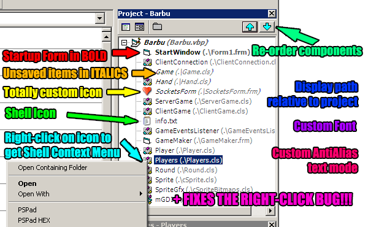

<div align="center">

## TheTreeSurgeon \- Major enhancements for the VB6 Project Tree \(updated: fix for SDI\)


</div>

### Description

This VB6 Add-In gives you a bunch of special options for the IDE Project Tree. All options are configurable through a control panel (access through the AddIns menu). While there are a lot of enhancements, my absolute favorite is the ability to re-order the items in the tree. 

----

Updated : fix for the SDI mode + other bits
 
### More Info
 
(also check out the [imho] cool minidemo on the about page!)


<span>             |<span>
---                |---
**Submitted On**   |2006-08-09 00:16:30
**By**             |[grigri](https://github.com/Planet-Source-Code/PSCIndex/blob/master/ByAuthor/grigri.md)
**Level**          |Advanced
**User Rating**    |5.0 (60 globes from 12 users)
**Compatibility**  |VB 6\.0
**Category**       |[Complete Applications](https://github.com/Planet-Source-Code/PSCIndex/blob/master/ByCategory/complete-applications__1-27.md)
**World**          |[Visual Basic](https://github.com/Planet-Source-Code/PSCIndex/blob/master/ByWorld/visual-basic.md)
**Archive File**   |[TheTreeSur201216892006\.zip](https://github.com/Planet-Source-Code/grigri-thetreesurgeon-major-enhancements-for-the-vb6-project-tree-updated-fix-for-sdi__1-66210/archive/master.zip)

### API Declarations

```
' There are absolutely shedloads of api declares.
' In the future, I'll move them into a type library.
' If you're brave enough, try wading through "ApiDeclares.bas"
```


